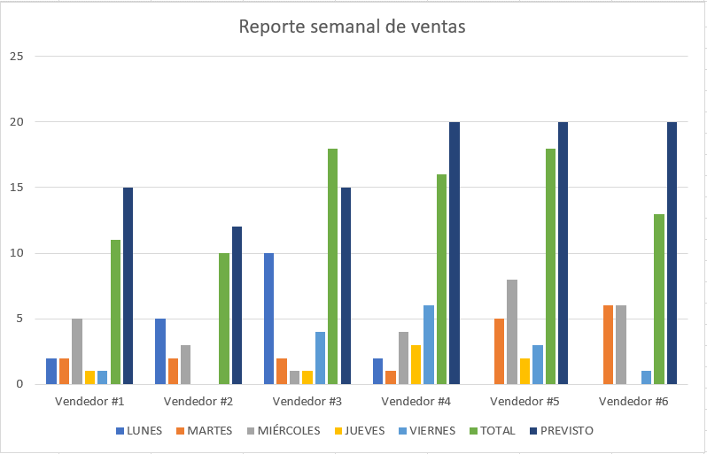

# 📊 Data Insight Visualizer

## 🚀 Descripción
**Data Insight Visualizer** es un proyecto final del curso *Inteligencia Artificial y Generación de Prompts* de Coderhouse. 

El objetivo es demostrar cómo la integración de IA y *prompt engineering* puede facilitar la comprensión de datos empresariales mediante:
- Resúmenes ejecutivos generados por IA.
- Visualizaciones gráficas de datos.
- Imágenes creadas con prompts para acompañar reportes.

---

## 📝 Contenido del repositorio
- `DataInsightVisualizer_Final.ipynb`: Notebook con la implementación del proyecto (dataset, gráficos, prompts y resultados).
- `informe_final.pdf`: Documento con la descripción teórica (resumen, introducción, objetivos, metodología, resultados y conclusiones).
- `imagen_IA.png`: Imagen generada con Nightcafe/DALL·E a partir de un prompt.

---

## 📌 Objetivos del proyecto
1. Analizar datos de un dataset de ventas.
2. Crear visualizaciones gráficas que reflejen tendencias.
3. Utilizar *prompt engineering* para generar resúmenes ejecutivos.
4. Implementar un prompt de texto→imagen para enriquecer la presentación.

---

## ⚙️ Tecnologías utilizadas
- **Python** (Pandas, Matplotlib, Seaborn)
- **Jupyter Notebook**
- **ChatGPT** (texto→texto)
- **DALL·E / Nightcafe** (texto→imagen)

---

## 📊 Ejemplo de visualización


---

## 🤖 Ejemplo de prompts
**Texto → Texto**:
```text
Resume en un párrafo ejecutivo los hallazgos principales del análisis de ventas, destacando tendencias y oportunidades de negocio.
```

**Texto → Imagen**:
```text
Diseña una infografía minimalista y clara que muestre el crecimiento de las ventas a lo largo del año, con colores corporativos y estilo profesional.
```

---

## 📈 Resultados
- Se logró generar un reporte ejecutivo en menos tiempo que el proceso manual.
- Los gráficos facilitaron la interpretación de tendencias.
- Los resúmenes de IA fueron claros y concisos.
- La imagen IA complementó visualmente la presentación final.

---

## ✅ Conclusiones
El proyecto demostró la viabilidad de integrar IA en procesos de análisis de datos, optimizando tiempo y mejorando la comunicación de resultados en entornos corporativos.

---

## 📚 Referencias
- Kimball, R., & Ross, M. (2013). *The Data Warehouse Toolkit*.
- Coderhouse (2025). *Curso de Inteligencia Artificial y Generación de Prompts*.
